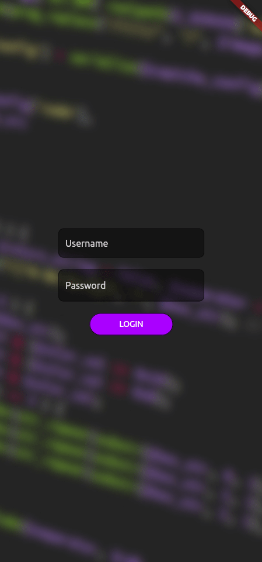

# Flutter Login
A basic Flutter demo app to showcase my abilities as a fullstack engineer. In this repository you'll find a very basic API server written in JavaScript on Node and a Flutter app that interacts with the login endpoint.

Disclaimer: Could I make the API server more robust and add some niceties to the app? Yes, and probably will. Currently the text inputs don't lose focus when clicking outside.

## Starting the Server
In order to run the API server for the app to work, you'll need to:
1. Run the `yarn` command within the `/server` folder to install dependencies.
2. Run `yarn server` from within the `/server` directory.

## Running the application
The only tested versions of this app is for Linux desktop and web. To run from the web (easiest), first install the dependencies with `flutter pub get`. Then run the application with `flutter run -d chrome`.

Note: To login to the app user: 'guest', password: 'guest'